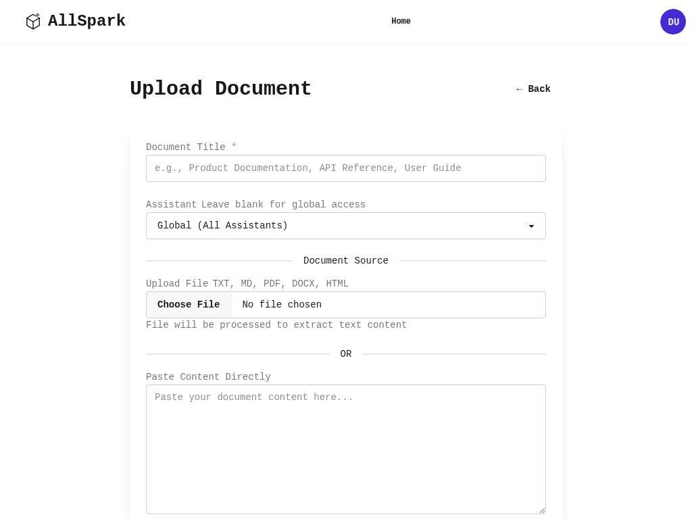
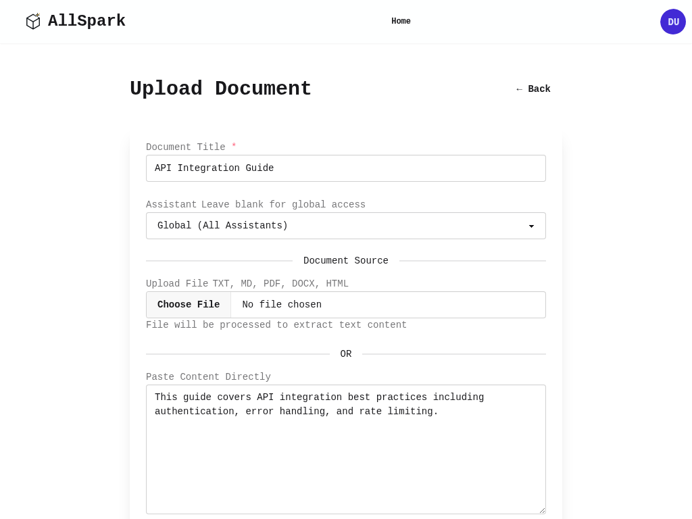

# Knowledge Base User Guide

The AllSpark Knowledge Base is a powerful system for organizing, searching, and managing documentation and knowledge within your organization. With advanced tagging, categorization, and semantic search capabilities, it helps teams find the information they need quickly and efficiently.

## Table of Contents

1. [Overview](#overview)
2. [Accessing the Knowledge Base](#accessing-the-knowledge-base)
3. [Browsing Documents](#browsing-documents)
4. [Searching for Documents](#searching-for-documents)
5. [Creating New Documents](#creating-new-documents)
6. [Managing Tags and Metadata](#managing-tags-and-metadata)
7. [Editing Documents](#editing-documents)
8. [Using Filters](#using-filters)
9. [Best Practices](#best-practices)

## Overview

The Knowledge Base provides:

- **Semantic Search**: AI-powered search that understands the meaning of your queries
- **Flexible Tagging**: Organize documents with tags, categories, and projects
- **Custom Metadata**: Add any custom attributes to documents
- **Visibility Control**: Set who can access your documents
- **Priority Levels**: Mark important documents for easy identification
- **Automatic Chunking**: Large documents are automatically split for better search results

## Accessing the Knowledge Base

To access the Knowledge Base:

1. Log into AllSpark
2. Navigate to the main menu
3. Click on "Knowledge Base" or go directly to `/agents/knowledge_documents`

## Browsing Documents

### Main Knowledge Base View

When you first access the Knowledge Base, you'll see:

- **Search Bar**: At the top for semantic AI-powered search
- **Upload Button**: To add new documents
- **Statistics Section**: Shows total documents, chunks, and document types
- **Document List**: Table showing all documents with their metadata

The document list displays:
- Document title with tags
- Document type (Documentation, Code, etc.)
- Associated assistant (if any)
- Number of chunks
- File attachment indicator
- Creation date
- Action buttons

### Document Tags

Documents can have multiple tags displayed as small badges beneath the title. Common tags might include:
- `api`, `documentation`, `tutorial`
- `security`, `best-practices`
- `mobile`, `ios`, `android`
- `database`, `postgresql`, `schema`

## Searching for Documents

### Semantic Search

The Knowledge Base uses AI-powered semantic search:

1. Enter a natural language query in the search box
2. Examples:
   - "How do I authenticate with the API?"
   - "Database schema best practices"
   - "Mobile app installation troubleshooting"
3. Click "Search" or press Enter
4. Results are ranked by relevance, not just keyword matching

### Understanding Search Results

Search results show:
- Matching documents with highlighted relevant sections
- Tags and metadata for context
- Relevance score (implicitly through ordering)

## Creating New Documents

### Step 1: Basic Information

1. Click "Upload Document" button
2. Fill in the required fields:
   - **Title**: Clear, descriptive title
   - **Assistant**: Choose "Global" for all assistants or select specific one

   
### Step 2: Content Source

You have two options:

#### Option A: Upload a File
- Supported formats: TXT, MD, PDF, DOCX, HTML
- File will be processed to extract text content
- Large files are processed in the background

#### Option B: Paste Content
- Directly paste or type your content
- Supports Markdown formatting
- Immediate processing

### Step 3: Source Information

- **Source Type**: Select from:
  - Documentation
  - Knowledge Base
  - FAQ
  - Tutorial
  - Reference
  - Other
- **Source URL**: Optional URL reference

### Step 4: Organization & Tags

This is where the enhanced metadata system shines:

#### Tags
- Enter comma-separated tags (e.g., "api, authentication, oauth2")
- Tags are automatically normalized (lowercase, no special characters)
- Suggested tags appear based on your content

#### Category
- Group related documents (e.g., "API Documentation", "User Guides")
- Use autocomplete to maintain consistency

#### Project
- Associate with specific projects (e.g., "Mobile App v2", "Backend Services")
- Helps filter documents by project context

#### Visibility
- **Private**: Only you can see it
- **Team**: All team members can access
- **Public**: Everyone in the organization
- **Restricted**: Specific users only (future feature)

#### Priority
- **Low**: Reference material
- **Normal**: Standard documentation
- **High**: Important documents
- **Critical**: Must-read content

#### Custom Attributes
- Add any key-value pairs
- Examples:
  - `version`: "2.0.0"
  - `author`: "Engineering Team"
  - `last_reviewed`: "2025-01-14"
  - `target_audience`: "Developers"

### Step 5: Submit

Click "Upload Document" to save. The system will:
1. Save the document
2. Generate embeddings for search
3. Create chunks for large documents
4. Index all metadata for filtering

## Managing Tags and Metadata

### Viewing Document Metadata

On the document view page, you'll see:

- **Tags**: Clickable badges that filter the knowledge base
- **Category & Project**: Clickable links for quick filtering
- **Visibility & Priority**: Status badges
- **Custom Attributes**: Listed in the metadata section

### Tag Management

#### Adding Tags
- During creation or editing
- Comma-separated list
- Automatic normalization and deduplication

#### Tag Best Practices
- Use consistent naming (e.g., always "api" not "API" or "apis")
- Include both general and specific tags
- Consider hierarchical tags (e.g., "security", "security-oauth", "security-api-keys")

### Categories and Projects

#### Categories
- High-level grouping (e.g., "Technical Documentation", "User Guides")
- One category per document
- Use for broad classification

#### Projects
- Specific project association
- Useful for project-based teams
- Can span multiple categories

## Editing Documents

1. Navigate to the document
2. Click "Edit" button
3. Update any fields:
   - Title and content
   - Tags and metadata
   - Visibility and priority
4. Click "Update Document"

### What Happens When You Edit

- Content changes trigger re-processing
- New chunks are generated if needed
- Embeddings are updated
- Metadata changes are immediate

## Using Filters

### Accessing Filters

1. On the Knowledge Base index page
2. Click "Filters" to expand the filter panel
3. Active filters show a count badge

### Available Filters

#### Tag Filtering
- Click tag badges to select/deselect
- "Match all" checkbox for AND vs OR logic
- Multiple tags can be selected

#### Category Filter
- Dropdown with all available categories
- Shows documents in selected category only

#### Project Filter
- Dropdown with all available projects
- Useful for project-specific views

#### Visibility Filter
- Filter by access level
- Useful for finding public vs private content

### Combining Filters

Filters work together:
- Search + Tags: Find specific content within tagged documents
- Category + Project: View project docs of specific type
- All filters are cumulative (AND logic between different filter types)

### Clearing Filters

- Click "Clear All" to reset
- Or modify individual filters
- Search query persists when changing filters

## Best Practices

### Document Organization

1. **Consistent Tagging**
   - Develop a tagging taxonomy
   - Document your tag conventions
   - Review and consolidate tags periodically

2. **Meaningful Titles**
   - Include key terms for searchability
   - Be specific but concise
   - Consider versioning in titles

3. **Structured Content**
   - Use headings for long documents
   - Include examples and code snippets
   - Add links to related documents

### Metadata Strategy

1. **Categories**
   - Limit to 5-10 main categories
   - Avoid overlapping categories
   - Review quarterly for relevance

2. **Projects**
   - Use active project names
   - Archive old project docs
   - Consider project phases

3. **Custom Attributes**
   - Define standard attributes for your team
   - Examples:
     - `status`: draft, review, approved
     - `department`: engineering, support, sales
     - `compliance`: gdpr, sox, hipaa

### Search Optimization

1. **Content Quality**
   - Write clear, descriptive content
   - Include synonyms and related terms
   - Provide context and examples

2. **Effective Queries**
   - Use natural language questions
   - Include context in searches
   - Try different phrasings

3. **Leveraging AI Search**
   - Ask complete questions
   - Mention specific technologies
   - Include problem descriptions

### Maintenance

1. **Regular Reviews**
   - Check for outdated content
   - Update version numbers
   - Verify external links

2. **Tag Cleanup**
   - Merge similar tags
   - Remove unused tags
   - Standardize naming

3. **Access Control**
   - Review visibility settings
   - Update team documents
   - Archive old content

## Advanced Features

### Semantic Search Tips

The AI-powered search understands:
- Synonyms (e.g., "auth" finds "authentication")
- Concepts (e.g., "login issues" finds password reset docs)
- Context (e.g., "mobile app crashes" focuses on mobile-specific content)

### Bulk Operations (Coming Soon)

Future updates will include:
- Bulk tag updates
- Mass visibility changes
- Export/import functionality

### Integration with Assistants

Documents can be:
- Globally accessible to all assistants
- Restricted to specific assistants
- Used as context for AI responses

## Troubleshooting

### Common Issues

1. **Search Not Finding Documents**
   - Check if documents are processed (have chunks)
   - Verify visibility settings
   - Try broader search terms

2. **Upload Failures**
   - Check file format compatibility
   - Ensure file size is reasonable
   - Try pasting content instead

3. **Missing Filters**
   - Filters only appear when documents have those attributes
   - Add tagged documents to see tag filters
   - Set categories to enable category filter

### Getting Help

- Check the system documentation
- Contact your administrator
- Submit feedback for improvements

## Summary

The AllSpark Knowledge Base combines powerful AI search with flexible organization tools. By effectively using tags, categories, and custom metadata, teams can build a searchable repository of knowledge that grows more valuable over time.

Key takeaways:
- Use semantic search for natural language queries
- Organize with tags, categories, and projects
- Set appropriate visibility and priority
- Add custom metadata for your specific needs
- Maintain and review content regularly

The system is designed to make finding information fast and intuitive while providing the structure needed for large-scale knowledge management.