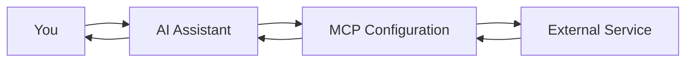

# MCP (Model Context Protocol) User Guide

Welcome to the MCP user guide! This guide will help you understand and use MCP configurations to enhance your AI assistants with external tools and services.

## Table of Contents

1. [Getting Started](./getting-started.md)
2. [Managing Configurations](./managing-configurations.md)
3. [Using Templates](./using-templates.md)
4. [Custom Configurations](./custom-configurations.md)
5. [Troubleshooting](./troubleshooting.md)
6. [Best Practices](./best-practices.md)

## Quick Start

### What is MCP?

MCP (Model Context Protocol) is a system that allows AI assistants to interact with external tools and services. Think of it as giving your AI assistant superpowers to:

- 📝 Create and manage tasks in Linear
- 🐙 Work with GitHub repositories
- 💬 Send messages to Slack
- 🗄️ Query databases
- 📁 Access files (with permissions)
- 🔧 Run custom tools

### Your First Configuration

1. Navigate to **MCP Configurations** in the sidebar
2. Choose a template (try Linear or GitHub)
3. Enter your API credentials
4. Create the configuration
5. Start using it in Claude Code!

## Available Templates

AllSpark includes pre-configured templates for popular services:

| Service | Description | Required Credentials |
|---------|-------------|---------------------|
| **Linear** | Issue tracking and project management | Linear API Key |
| **GitHub** | Code repositories and issues | GitHub Personal Access Token |
| **Slack** | Team communication | Bot Token & App Token |
| **File System** | Local file access | Directory paths |
| **Docker** | Container management | None (uses local Docker) |
| **PostgreSQL** | Database queries | Database URL |
| **Redis** | Cache operations | Redis URL |

## How It Works



1. You ask the AI to perform a task
2. The AI uses the appropriate MCP configuration
3. The configuration connects to the external service
4. Results are returned to the AI
5. The AI presents the results to you

## Configuration Types

### For Claude Code

Claude Code supports all configuration types:
- ✅ **stdio** - Command-line tools
- ✅ **http** - REST APIs
- ✅ **sse** - Server-sent events
- ✅ **websocket** - Real-time connections

### For Assistants

Assistants currently support:
- ✅ **http** - REST APIs
- ✅ **sse** - Server-sent events
- ✅ **websocket** - Real-time connections
- ⏳ **stdio** - Coming soon!

## Common Use Cases

### Development Workflow
```
You: "Create a new Linear issue for the bug we just discussed"
AI: "I'll create that issue for you..." 
*Creates issue in Linear*
AI: "Created issue LIN-123: Fix authentication bug"
```

### Code Management
```
You: "Show me recent PRs in our main repository"
AI: "Let me check GitHub for recent pull requests..."
*Queries GitHub API*
AI: "Here are the 5 most recent PRs:..."
```

### Team Communication
```
You: "Send a message to #dev-team about the deployment"
AI: "I'll send that message to Slack..."
*Posts to Slack*
AI: "Message posted to #dev-team"
```

## Security & Privacy

- 🔐 All credentials are encrypted
- 👤 Configurations are private to your account
- 🔍 No one else can see your API keys
- 📊 Usage is logged for debugging only

## Need Help?

- Check the [Troubleshooting Guide](./troubleshooting.md)
- Read the [Best Practices](./best-practices.md)
- Contact support if you're stuck

## Next Steps

1. [Create your first configuration](./getting-started.md)
2. [Explore available templates](./using-templates.md)
3. [Build a custom integration](./custom-configurations.md)

---

Ready to get started? Let's go! 🚀