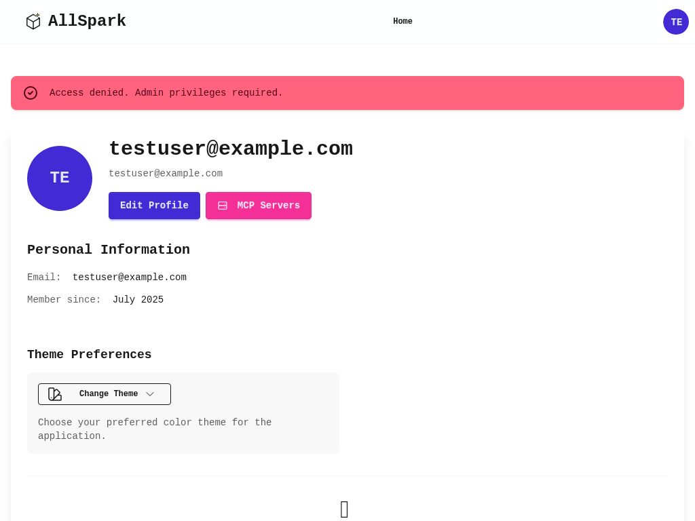
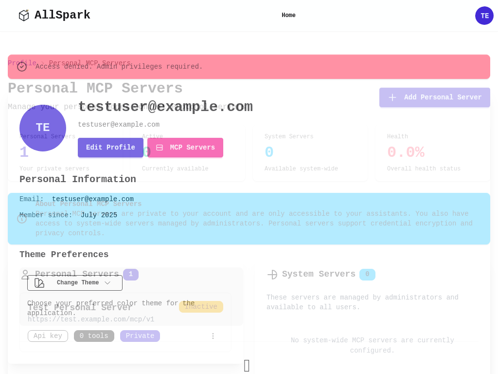
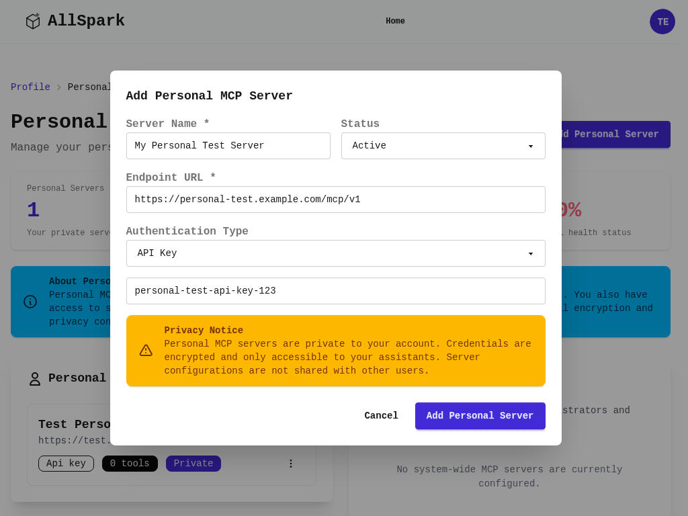

# AllSpark MCP (Model Context Protocol) Complete User Guide

## Table of Contents

1. [Introduction to MCP in AllSpark](#introduction-to-mcp-in-allspark)
2. [System Architecture and Access Levels](#system-architecture-and-access-levels)
3. [Admin User Journey: System-Wide MCP Management](#admin-user-journey-system-wide-mcp-management)
4. [User Journey: Personal MCP Servers](#user-journey-personal-mcp-servers)
5. [User Journey: MCP Assistant Integration](#user-journey-mcp-assistant-integration)
6. [Analytics and Monitoring](#analytics-and-monitoring)
7. [Security and Best Practices](#security-and-best-practices)
8. [Troubleshooting and Support](#troubleshooting-and-support)

## Introduction to MCP in AllSpark

### What is MCP?

Model Context Protocol (MCP) is an open protocol that enables AI assistants to securely connect to external services, tools, and data sources. In AllSpark, MCP servers provide a standardized way to extend your AI assistants' capabilities beyond their base training.

### MCP Capabilities in AllSpark

- **External API Integration**: Connect to weather services, databases, file systems
- **Real-Time Data Access**: Fetch live information and dynamic content
- **Custom Business Logic**: Execute organization-specific workflows and processes
- **Third-Party Services**: Integrate with CRM, ERP, and other business systems
- **Secure Tool Execution**: Authenticated and authorized access to sensitive resources

### Key Benefits

1. **Extensibility**: Unlimited expansion of assistant capabilities
2. **Security**: Encrypted credentials and scoped access controls
3. **Flexibility**: Support for multiple authentication methods
4. **Scalability**: From personal tools to enterprise-wide integrations
5. **Standardization**: Open protocol ensures compatibility and interoperability

## System Architecture and Access Levels

### MCP Server Types

AllSpark supports three levels of MCP server deployment:

#### 1. System-Wide Servers
- **Managed by**: System administrators
- **Access**: Available to all users
- **Use Cases**: Shared tools, enterprise integrations, common services
- **Examples**: Company weather API, shared database access, organizational calendar

#### 2. Instance-Specific Servers  
- **Managed by**: Instance administrators
- **Access**: Available to users within specific instances
- **Use Cases**: Team tools, department-specific integrations
- **Examples**: Team project management tools, department databases

#### 3. Personal Servers
- **Managed by**: Individual users
- **Access**: Private to the user's account
- **Use Cases**: Personal integrations, individual API keys, private tools
- **Examples**: Personal cloud storage, individual API subscriptions

### User Roles and Permissions

#### System Administrators
- Create and manage system-wide MCP servers
- Access comprehensive analytics and monitoring
- Configure global MCP policies and security settings
- Monitor all MCP server health and performance

#### Instance Administrators  
- Manage MCP servers for their instances
- Configure instance-specific access controls
- Monitor instance MCP usage and performance

#### Regular Users
- Create and manage personal MCP servers
- Configure assistants to use available MCP tools
- Access usage analytics for their own servers

## Admin User Journey: System-Wide MCP Management

### Accessing Admin MCP Management

System administrators can access MCP management through the admin panel:

1. Navigate to **Admin** → **MCP Servers**
2. View the comprehensive MCP server dashboard

**Admin Dashboard Elements:**

- **Server Overview**: Total servers, health statistics, and performance metrics
- **Server List**: All system-wide MCP servers with status indicators
- **Bulk Actions**: Manage multiple servers simultaneously
- **Analytics Link**: Access detailed usage and performance analytics
- **Health Indicators**: Real-time status of all servers

### Creating System-Wide MCP Servers

#### Step 1: Initiate Server Creation

1. Click **"Add MCP Server"** in the admin dashboard
2. Access the comprehensive server creation form

#### Step 2: Configure Basic Server Information

**Required Fields:**
- **Server Name**: Descriptive name for the server (e.g., "Company Weather API")
- **Endpoint URL**: Full URL to the MCP server endpoint
- **Protocol Version**: MCP protocol version (default: 1.0)
- **Status**: Active, Inactive, or Error

**Optional Configuration:**
- **Description**: Detailed explanation of server purpose
- **Tags**: Categorization and organization labels
- **Priority**: Execution priority for tool selection

#### Step 3: Authentication Configuration

AllSpark supports multiple authentication methods:

##### No Authentication
- For public APIs or internal servers without authentication
- No additional configuration required

##### API Key Authentication
- **API Key**: Server authentication key
- **API Key Header**: Custom header name (default: "Authorization")
- **Key Format**: Bearer token, API key, or custom format

##### Bearer Token Authentication  
- **Bearer Token**: Authentication token value
- **Token Refresh**: Automatic token refresh configuration
- **Expiration Handling**: Token renewal and failure handling

##### OAuth 2.0 Authentication
- **Client ID**: OAuth application identifier
- **Client Secret**: OAuth application secret
- **Authorization Endpoint**: OAuth authorization URL
- **Token Endpoint**: OAuth token exchange URL
- **Scope**: Required OAuth permissions
- **Redirect URI**: Callback URL for OAuth flow

#### Step 4: Advanced Configuration

**Connection Settings:**
- **Timeout**: Request timeout in milliseconds
- **Retry Policy**: Number of retries and backoff strategy
- **Rate Limiting**: Requests per second/minute/hour limits
- **Health Check Interval**: How often to verify server health

**Tool Discovery Settings:**
- **Auto-Discovery**: Automatic tool detection and updates
- **Discovery Schedule**: How often to refresh available tools
- **Tool Filtering**: Include/exclude specific tools or categories
- **Version Management**: Handle tool version changes

### Managing Existing Servers

#### Server Health Monitoring

Each server displays real-time health information:
- **🟢 Active**: Server responding normally
- **🟡 Warning**: Performance issues or intermittent problems  
- **🔴 Error**: Server unreachable or authentication failing

#### Server Operations

**Test Connection**: Verify server connectivity and authentication
**Discover Tools**: Refresh the list of available tools
**Edit Configuration**: Modify server settings and credentials
**Monitor Performance**: View detailed analytics and logs
**Delete Server**: Permanently remove server (with confirmation)

#### Bulk Operations

Administrators can perform bulk actions on multiple servers:
- **Activate/Deactivate**: Change status of multiple servers
- **Test Connections**: Verify multiple servers simultaneously
- **Discover Tools**: Refresh tool lists for multiple servers
- **Export Configuration**: Download server configurations
- **Import Configuration**: Bulk import server settings

### MCP Analytics Dashboard

The analytics dashboard provides comprehensive insights:

#### Overview Metrics
- **Total Servers**: Count of all configured servers
- **Active Servers**: Currently operational servers
- **Total Executions**: Number of tool calls across all servers
- **Success Rate**: Percentage of successful tool executions
- **Average Response Time**: Performance across all servers

#### Usage Trends
- **Daily Usage**: Tool execution patterns over time
- **Popular Tools**: Most frequently used tools and servers
- **User Activity**: Tool usage by user and assistant
- **Error Patterns**: Common failure modes and resolution trends

#### Performance Analysis
- **Response Time Distribution**: Performance characteristics
- **Server Load**: Resource utilization and capacity planning
- **Tool Popularity**: Usage patterns and adoption metrics
- **Health Trends**: Server reliability over time

#### Detailed Reporting
- **Server-Specific Analytics**: Individual server performance
- **Tool Usage Reports**: Detailed tool execution logs
- **User Access Patterns**: How different users utilize MCP tools
- **Error Analysis**: Failure investigation and resolution tracking

## User Journey: Personal MCP Servers

### Understanding Personal MCP Servers

Personal MCP servers are private integrations that only you can create, manage, and use. They're perfect for:
- Personal API subscriptions and keys
- Individual cloud service integrations
- Private databases and file systems
- Custom tools and workflows

### Accessing Personal MCP Management

**Navigation Path:**
1. Click on your profile/avatar in the top navigation
2. Navigate to your user profile page
3. Click on **"MCP Servers"** link

### Personal MCP Server Dashboard

**Dashboard Components:**

#### Health Overview (Top Statistics)
- **Personal Servers**: Your private server count
- **Active**: Currently functioning personal servers
- **System Servers**: Available system-wide servers
- **Health**: Overall health percentage of your servers

#### Personal Servers Section (Left Panel)
**Your Private Servers:**
- Complete list of your personal MCP servers
- Server details including name, endpoint, and status
- Authentication type and tool count
- **Private** label indicating user-specific access
- Management dropdown with Test, Edit, and Delete options

#### System Servers Section (Right Panel)
**Shared Resources:**
- Read-only view of system-wide servers
- Available tools and their descriptions
- **System-wide** label indicating shared access
- Managed by administrators

### Creating Personal MCP Servers

#### Step 1: Open Creation Modal

Click **"Add Personal Server"** to open the configuration modal.

#### Step 2: Basic Configuration

**Server Information:**
- **Server Name**: Friendly identifier for your server
- **Endpoint URL**: Where your MCP server is hosted
- **Status**: Active (available to assistants) or Inactive (disabled)

#### Step 3: Authentication Setup

**Authentication Types:**
- **No Authentication**: For public or internal services
- **API Key**: Most common for personal APIs
- **Bearer Token**: For token-based authentication
- **OAuth 2.0**: For services requiring OAuth flow

**Security Features:**
- **Credential Encryption**: All credentials encrypted at rest
- **User Isolation**: Only your assistants can access your servers
- **Secure Transmission**: HTTPS/TLS for all communications

#### Step 4: Privacy and Security

**Privacy Notice:**
> Personal MCP servers are private to your account. Credentials are encrypted and only accessible to your assistants. Server configurations are not shared with other users.

**Key Privacy Features:**
- Complete user isolation and privacy
- Encrypted credential storage
- No cross-user access or sharing
- Secure API key management

### Managing Personal Servers

#### Server Operations
- **Test Connection**: Verify server accessibility
- **Edit Configuration**: Modify settings and credentials
- **Delete Server**: Permanently remove (with confirmation)
- **View Tools**: See available tools and capabilities

#### Status Monitoring
- **Connection Health**: Real-time server status
- **Performance Metrics**: Response times and reliability
- **Usage Statistics**: How often tools are used
- **Error Tracking**: Issues and resolution status

## User Journey: MCP Assistant Integration

### Understanding MCP Tools in Assistants

MCP tools extend your AI assistants' capabilities by connecting them to external services and data sources. Once configured, assistants can:

- Automatically detect when tools are needed
- Execute tool calls transparently
- Integrate results into natural responses
- Chain multiple tools for complex tasks

### Configuring Assistants for MCP Tools

#### Step 1: Access Assistant Management

Navigate to **AI Agents** → **Assistants** to see your assistant list.

#### Step 2: Create or Edit Assistant

**For New Assistants:**
1. Click **"New Assistant"** or **"Create Assistant"**
2. Fill in basic information (name, description, instructions)
3. Navigate to the Tools configuration section

**For Existing Assistants:**
1. Find your assistant in the list
2. Click **"Edit"** or the configuration icon
3. Access the Tools configuration

#### Step 3: Enable MCP Tools

**Basic Configuration:**
- Check **"Enable MCP Tools"** to activate integration
- Select **"All Available Tools"** for full access
- Or choose **"Selective Tool Access"** for specific tools

**Advanced Configuration:**
- **Server Filtering**: Limit to specific MCP servers
- **Tool Categories**: Filter by tool type (data, computation, etc.)
- **Rate Limiting**: Control tool usage frequency
- **Error Handling**: Define fallback behavior

#### Step 4: Tool Access Scoping

**Automatic Scoping:**
- **Personal Servers**: Your private servers are automatically available
- **System Servers**: Based on your user permissions
- **Instance Servers**: Based on your instance membership

**Permission Levels:**
- **Read-Only**: Information retrieval tools
- **Write Operations**: Data modification tools (requires explicit permission)
- **Administrative**: System management tools (admin users only)
- **External APIs**: Third-party service tools

### Using Assistants with MCP Tools

#### Natural Language Tool Invocation

Assistants automatically determine when to use tools based on conversation context:

**Weather Queries:**
- User: "What's the weather in New York?"
- Assistant uses weather MCP tool → Returns current conditions

**Data Requests:**
- User: "Show me last month's sales figures"
- Assistant uses database MCP tool → Queries and formats results

**File Operations:**
- User: "Create a report from the customer data"
- Assistant uses file system MCP tools → Generates report

#### Tool Chain Execution

Advanced scenarios where assistants use multiple tools:

1. **Data Pipeline**: Fetch → Process → Store → Notify
2. **Research Workflow**: Search → Analyze → Summarize → Save
3. **Automation Sequence**: Monitor → Detect → Alert → Resolve

#### Tool Result Integration

MCP tool results are seamlessly woven into assistant responses:
- **Structured Data**: Tables, lists, formatted information
- **Visual Elements**: Charts, graphs, images
- **File Attachments**: Documents, reports, generated content
- **Real-Time Updates**: Live data, streaming information

## Analytics and Monitoring

### User-Level Analytics

#### Personal Server Monitoring

Track your personal MCP server performance:
- **Usage Frequency**: How often your tools are used
- **Response Times**: Performance characteristics
- **Success Rates**: Reliability metrics
- **Error Patterns**: Common issues and resolutions

#### Assistant Tool Usage

Monitor how your assistants use MCP tools:
- **Tool Preferences**: Which tools are favored
- **Success Patterns**: Most reliable tool combinations
- **Performance Impact**: How tools affect response times
- **User Satisfaction**: Effectiveness of tool integration

### System-Level Analytics (Admin)

#### Global Usage Patterns
- **Server Utilization**: Load distribution across servers
- **Tool Popularity**: Most used tools across the system
- **User Adoption**: MCP feature usage by user base
- **Performance Trends**: System-wide performance patterns

#### Health and Reliability
- **Server Uptime**: Availability across all servers
- **Error Analysis**: System-wide failure patterns
- **Performance Benchmarks**: Response time distributions
- **Capacity Planning**: Resource utilization and growth

### Monitoring Dashboard Features

#### Real-Time Status
- **Server Health**: Live status indicators
- **Active Connections**: Current tool usage
- **Response Times**: Real-time performance metrics
- **Error Alerts**: Immediate issue notifications

#### Historical Trends
- **Usage Patterns**: Tool usage over time
- **Performance Evolution**: Response time trends
- **Reliability Metrics**: Success rate trends
- **Growth Analysis**: Adoption and expansion patterns

## Security and Best Practices

### Security Architecture

#### Authentication and Authorization
- **Multi-Layer Security**: Server, tool, and user-level access controls
- **Credential Encryption**: Industry-standard encryption for all credentials
- **Access Scoping**: Tools limited to appropriate user permissions
- **Audit Logging**: Comprehensive logging of all tool access

#### Data Protection
- **Encryption in Transit**: TLS/HTTPS for all communications
- **Encryption at Rest**: Secure storage of credentials and configurations
- **Data Isolation**: Complete separation between user environments
- **Privacy Controls**: User data never shared across boundaries

### Best Practices for Users

#### Personal MCP Server Security
1. **Strong Credentials**: Use unique, complex API keys and tokens
2. **Regular Rotation**: Periodically update credentials
3. **Minimal Permissions**: Use credentials with least necessary privileges
4. **Monitor Usage**: Review server access logs regularly
5. **Test Regularly**: Verify server functionality and security

#### Assistant Configuration Security
1. **Selective Tool Access**: Only enable necessary tools
2. **Monitor Usage**: Track tool usage patterns
3. **Error Handling**: Configure appropriate fallback behaviors
4. **Regular Review**: Audit tool configurations periodically
5. **Performance Monitoring**: Watch for unusual patterns

### Best Practices for Administrators

#### System-Wide Server Management
1. **Security Standards**: Enforce strong authentication requirements
2. **Regular Audits**: Review server configurations and access patterns
3. **Performance Monitoring**: Track system-wide metrics and trends
4. **Capacity Planning**: Monitor resource usage and plan expansion
5. **Incident Response**: Prepare for security incidents and outages

#### Policy and Governance
1. **Access Controls**: Define clear user permission policies
2. **Usage Guidelines**: Establish appropriate use policies
3. **Data Handling**: Ensure compliance with data protection regulations
4. **External Access**: Control and monitor third-party integrations
5. **Documentation**: Maintain comprehensive configuration documentation

### Compliance Considerations

#### Data Protection
- **GDPR Compliance**: Appropriate data handling and user rights
- **Data Residency**: Control over data location and processing
- **Access Logging**: Comprehensive audit trails
- **Right to Deletion**: Proper data removal procedures

#### Enterprise Security
- **Single Sign-On**: Integration with organizational identity systems
- **Role-Based Access**: Alignment with organizational hierarchies
- **Security Monitoring**: Integration with security information systems
- **Incident Response**: Coordination with organizational security teams

## Troubleshooting and Support

### Common Issues and Solutions

#### Connection Problems

**Symptoms**: Server shows error status, connection tests fail
**Causes**: Network issues, incorrect URLs, server downtime
**Solutions**:
1. Verify endpoint URL is correct and accessible
2. Check network connectivity and firewall settings
3. Confirm server is running and responding
4. Review server logs for detailed error information
5. Contact server administrator if using shared resources

#### Authentication Failures

**Symptoms**: "Unauthorized" or "Forbidden" errors
**Causes**: Invalid credentials, expired tokens, insufficient permissions
**Solutions**:
1. Verify API keys and tokens are correct
2. Check credential format and header requirements
3. Ensure credentials have sufficient permissions
4. Test credentials directly with the server
5. Check for credential expiration and renewal needs

#### Tool Discovery Issues

**Symptoms**: Server connects but no tools available
**Causes**: MCP protocol issues, server configuration problems
**Solutions**:
1. Verify server implements MCP protocol correctly
2. Check server's tool discovery endpoint
3. Review server logs for discovery errors
4. Ensure tools are properly defined in server
5. Test tool discovery manually using MCP client

#### Performance Problems

**Symptoms**: Slow responses, timeouts, degraded performance
**Causes**: Server overload, network latency, resource constraints
**Solutions**:
1. Check server performance and resource usage
2. Verify network connectivity and latency
3. Review server configuration and optimization
4. Consider caching for frequently used tools
5. Monitor and adjust timeout settings

#### Assistant Integration Issues

**Symptoms**: Tools not being used, incorrect results, errors in conversation
**Causes**: Configuration problems, tool compatibility issues
**Solutions**:
1. Verify assistant has MCP tools enabled
2. Check tool selection and filtering configuration
3. Review tool schemas and parameter validation
4. Test tools independently of assistant
5. Check assistant instructions and tool integration

### Getting Help

#### Self-Service Resources
1. **Documentation**: Comprehensive guides and references
2. **Server Logs**: Detailed error messages and debugging information
3. **Test Tools**: Built-in connection and tool testing
4. **Analytics**: Performance and usage insights
5. **Community Forums**: User community support and discussions

#### Administrator Support
1. **System Logs**: Administrator access to detailed system logs
2. **Monitoring Tools**: Comprehensive system monitoring and alerting
3. **Configuration Review**: Administrator assistance with configuration
4. **Performance Analysis**: Detailed performance troubleshooting
5. **Policy Guidance**: Help with security and governance policies

#### Technical Support
1. **Issue Tracking**: Systematic issue reporting and tracking
2. **Expert Assistance**: Technical expert support for complex issues
3. **Escalation Procedures**: Clear escalation paths for critical issues
4. **Documentation Updates**: Contribution to improved documentation
5. **Feature Requests**: Pathway for suggesting improvements

### Maintenance and Updates

#### Regular Maintenance Tasks

**For Users:**
- Review and update personal server credentials
- Monitor personal server performance and usage
- Update assistant tool configurations as needed
- Clean up unused servers and tools

**For Administrators:**
- Review system-wide server health and performance
- Update server configurations and credentials
- Monitor usage patterns and capacity needs
- Review and update security policies

#### Update Procedures

**MCP Protocol Updates:**
- Automatic compatibility checking
- Graceful handling of version differences
- Migration assistance for protocol changes
- Backward compatibility maintenance

**Server Software Updates:**
- Coordination with server maintainers
- Testing of compatibility with updates
- Rollback procedures for problematic updates
- Communication of update schedules and impacts

## Conclusion

AllSpark's MCP integration provides a powerful, secure, and flexible platform for extending AI assistant capabilities. Whether you're a user creating personal integrations or an administrator managing enterprise-wide tools, MCP enables unlimited expansion of AI assistant functionality while maintaining security and control.

### Key Takeaways

1. **Flexible Architecture**: Support for personal, instance, and system-wide servers
2. **Security First**: Comprehensive security and privacy protections
3. **Easy Integration**: Natural language tool invocation and seamless result integration
4. **Comprehensive Monitoring**: Detailed analytics and health monitoring
5. **Scalable Solution**: From individual tools to enterprise-wide integrations

### Getting Started Recommendations

1. **Start Small**: Begin with a few essential tools and expand gradually
2. **Focus on Security**: Always use strong credentials and appropriate access controls
3. **Monitor Performance**: Track usage and performance to optimize configurations
4. **Plan for Growth**: Design configurations that can scale with your needs
5. **Engage Community**: Participate in the MCP community for best practices and support

The MCP integration in AllSpark represents a significant advancement in AI assistant capabilities, providing the foundation for unlimited customization and integration while maintaining the security and reliability required for enterprise use.