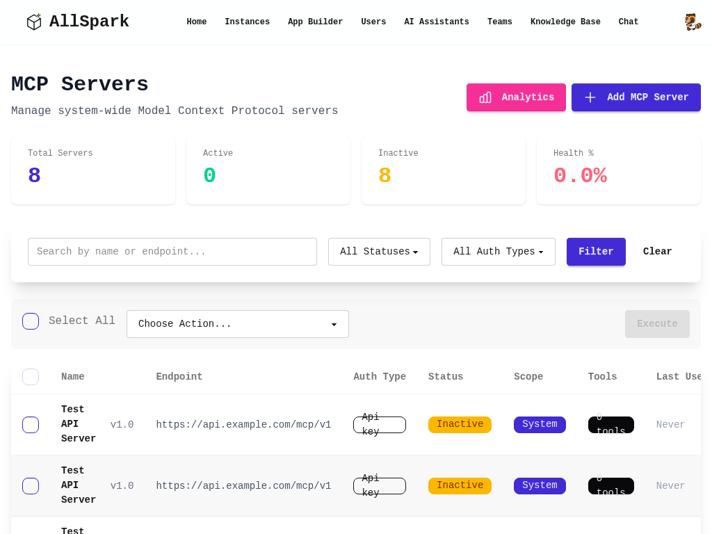
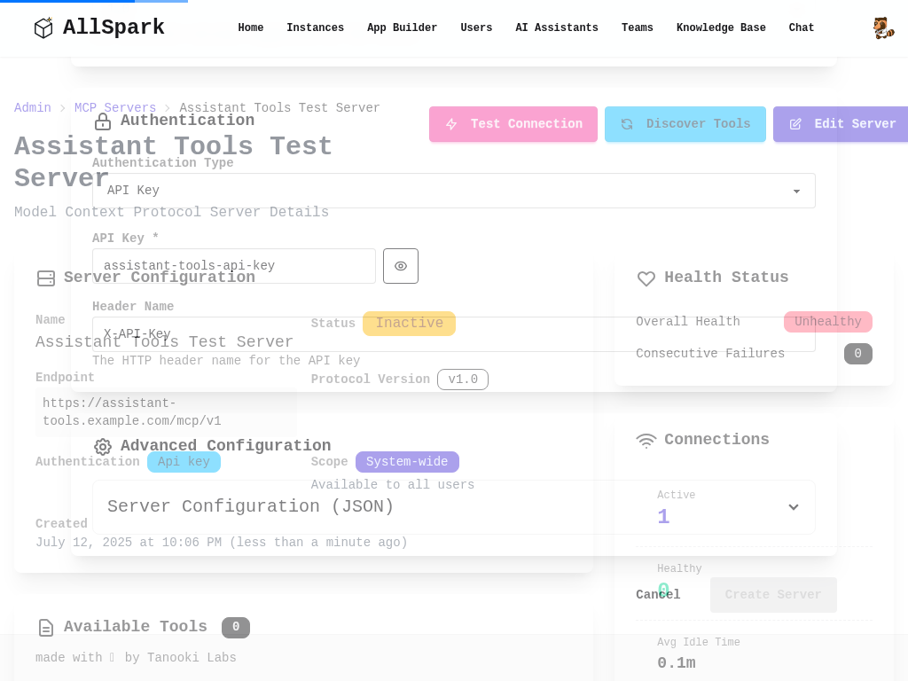

# MCP Assistant Tools Integration User Guide

## Overview

MCP (Model Context Protocol) Assistant Tools Integration allows your AI assistants to dynamically access and use tools from configured MCP servers. This powerful feature extends your assistants' capabilities beyond their base training, enabling them to:

- Access real-time data from external APIs
- Perform complex calculations and computations
- Interact with databases and file systems
- Execute custom business logic
- Integrate with third-party services

## How MCP Tools Work with Assistants

### The Integration Process

1. **Tool Discovery**: Assistants automatically discover available tools from accessible MCP servers
2. **Dynamic Loading**: Tools are loaded on-demand when assistants need specific capabilities
3. **Intelligent Selection**: Assistants choose appropriate tools based on user requests
4. **Secure Execution**: All tool calls are executed with proper authentication and access controls
5. **Result Integration**: Tool results are seamlessly integrated into assistant responses

### Types of MCP Servers Available to Assistants

Your assistants can access tools from three types of MCP servers:

1. **System-Wide Servers**: Managed by administrators, available to all users
2. **Personal Servers**: Your private servers with custom tools and credentials
3. **Instance Servers**: Shared within your organization or team instance

## Setting Up MCP Tools for Assistants

### Prerequisites

Before configuring MCP tools for your assistants, ensure you have:

- At least one MCP server configured (personal, system-wide, or instance-specific)
- An existing AI assistant or permission to create new assistants
- Understanding of what tools you want your assistant to access

### Step 1: Access Assistant Management

Navigate to the AI Assistants section in AllSpark:

1. Click on "AI Agents" in the main navigation
2. Select "Assistants" from the dropdown menu
3. You'll see a list of your existing assistants

**Assistant Management Interface Elements:**

- **Assistant List**: Shows all your created assistants
- **New Assistant Button**: Create a new assistant with MCP tools
- **Assistant Cards**: Each showing name, description, and status
- **Action Buttons**: Edit, Test, Delete, and Configure options
- **Performance Metrics**: Usage statistics and success rates

### Step 2: Create or Edit an Assistant

#### Creating a New Assistant with MCP Tools

1. Click "New Assistant" or "Create Assistant"
2. Fill in the basic information:
   - **Name**: Descriptive name for your assistant
   - **Description**: Brief explanation of the assistant's purpose
   - **Instructions/System Prompt**: Core behavior and personality

#### Configuring an Existing Assistant

1. Find your assistant in the list
2. Click "Edit" or the configuration icon
3. Navigate to the Tools section

### Step 3: Enable MCP Tools

In the assistant configuration interface:

1. **Locate Tools Section**: Find the "Tools" or "Available Tools" configuration area
2. **Enable MCP Integration**: Check the "Enable MCP Tools" option
3. **Tool Selection**: Choose which MCP tools to make available

#### MCP Tool Configuration Options

**Basic Configuration:**
- **Enable All MCP Tools**: Gives the assistant access to all available tools
- **Selective Tool Access**: Choose specific tools or servers
- **Tool Categories**: Filter tools by category (data, computation, integration, etc.)

**Advanced Configuration:**
- **Server Filtering**: Limit access to specific MCP servers
- **Tool Priority**: Set preferences when multiple tools serve similar functions
- **Rate Limiting**: Configure usage limits for expensive or rate-limited tools
- **Error Handling**: Define behavior when tools fail or are unavailable

### Step 4: Configure Tool Access Scope

#### User Context Scoping

MCP tools are automatically scoped based on your access permissions:

- **Personal Servers**: Only your private MCP servers are accessible
- **System Servers**: System-wide servers are available based on your role
- **Instance Servers**: Team/organization servers you have access to

#### Permission Management

- **Read-Only Tools**: Tools that only retrieve information
- **Write Operations**: Tools that modify data (require explicit permission)
- **Administrative Tools**: Tools for system management (admin users only)
- **External API Tools**: Tools that make external service calls

### Step 5: Test MCP Tool Integration

After configuration, test your assistant's MCP tool access:

1. **Tool Discovery Test**: Verify the assistant can see available tools
2. **Sample Queries**: Send test messages that should trigger tool usage
3. **Error Handling**: Test behavior when tools fail or are unavailable
4. **Performance Monitoring**: Check response times and success rates

## Using Assistants with MCP Tools

### Natural Language Tool Invocation

Your assistants will automatically use MCP tools when appropriate. Users don't need to explicitly request tool usage - the assistant intelligently determines when tools are needed.

#### Example Interactions

**Weather Information (using weather API MCP tool):**
- User: "What's the weather like in San Francisco?"
- Assistant uses MCP weather tool → Returns current conditions

**Data Retrieval (using database MCP tool):**
- User: "Show me sales data for last quarter"
- Assistant uses MCP database tool → Queries and formats results

**File Operations (using file system MCP tool):**
- User: "Create a summary report from the latest data"
- Assistant uses MCP file tools → Reads data, generates report

### Tool Chain Execution

Advanced assistants can chain multiple MCP tools together:

1. **Data Retrieval**: Fetch information using one tool
2. **Processing**: Transform data using computation tools
3. **Storage**: Save results using file or database tools
4. **Notification**: Send updates using communication tools

### Tool Result Integration

MCP tool results are seamlessly integrated into assistant responses:

- **Structured Data**: Tables, lists, and formatted information
- **Visual Elements**: Charts, graphs, and images (when supported)
- **File Attachments**: Documents, reports, and generated files
- **Real-Time Updates**: Live data and streaming information

## Monitoring and Management

### Assistant Performance with MCP Tools

#### Usage Analytics

Track how your assistants use MCP tools:

- **Tool Usage Frequency**: Which tools are used most often
- **Success Rates**: Percentage of successful tool executions
- **Response Times**: How tools affect assistant response speed
- **Error Patterns**: Common failure modes and issues

#### Performance Optimization

Optimize assistant performance:

- **Tool Selection**: Remove unused or slow tools
- **Caching**: Configure result caching for frequently used data
- **Timeout Settings**: Adjust timeouts for reliable operation
- **Fallback Strategies**: Define backup plans when tools fail

### MCP Server Health Monitoring

**Server Health Indicators:**
- **Connection Status**: Green (healthy), Yellow (warning), Red (error)
- **Response Times**: Average and peak response times
- **Availability**: Uptime percentage and reliability metrics
- **Error Rates**: Frequency and types of errors
- **Tool Discovery**: Status of tool detection and updates

### Troubleshooting Assistant Tool Issues

#### Common Problems and Solutions

**Tools Not Available:**
1. Verify MCP servers are active and responding
2. Check assistant has proper tool configuration enabled
3. Ensure user has access to required MCP servers
4. Review tool discovery logs for errors

**Tool Execution Failures:**
1. Check MCP server health and availability
2. Verify authentication credentials are valid
3. Review tool parameter validation
4. Check rate limiting and quota restrictions

**Slow Response Times:**
1. Monitor MCP server performance
2. Review tool complexity and data volume
3. Consider caching frequently used results
4. Optimize tool parameter efficiency

**Unexpected Tool Behavior:**
1. Review tool definitions and schemas
2. Check data format compatibility
3. Verify tool version compatibility
4. Test tools independently of assistant

## Security and Best Practices

### Tool Access Security

#### Authentication and Authorization

- **Credential Management**: MCP servers handle authentication securely
- **Access Control**: Tools are scoped to user permissions
- **Audit Logging**: All tool usage is logged for security monitoring
- **Rate Limiting**: Prevent abuse through usage limits

#### Data Protection

- **Encryption**: All data transmission uses TLS/HTTPS
- **Privacy**: User data is not shared between assistants
- **Isolation**: Tools run in isolated environments
- **Compliance**: Follows organizational data protection policies

### Best Practices for MCP Tool Configuration

#### Tool Selection Strategy

1. **Principle of Least Privilege**: Only enable tools that are necessary
2. **Category-Based Access**: Group tools by function and risk level
3. **Regular Review**: Periodically audit enabled tools
4. **Performance Impact**: Consider tool response times and complexity
5. **User Experience**: Balance capability with simplicity

#### Configuration Management

1. **Version Control**: Track configuration changes
2. **Testing**: Thoroughly test tool configurations before production
3. **Documentation**: Document tool purposes and usage patterns
4. **Backup**: Maintain configuration backups
5. **Rollback Plans**: Prepare for configuration issues

### Compliance and Governance

#### Organizational Policies

- **Tool Approval Process**: Require approval for new tool integrations
- **Usage Monitoring**: Track and report tool usage patterns
- **Data Handling**: Ensure tools comply with data protection requirements
- **External Access**: Control and monitor external API usage

#### Risk Management

- **Error Handling**: Graceful degradation when tools fail
- **Fallback Strategies**: Alternative approaches when tools are unavailable
- **Impact Assessment**: Understand consequences of tool failures
- **Recovery Procedures**: Plans for restoring tool functionality

## Advanced Features

### Custom Tool Development

For organizations with specific needs:

1. **MCP Server Development**: Create custom MCP servers with specialized tools
2. **Tool Schemas**: Define tool interfaces and parameters
3. **Integration Testing**: Validate tool behavior with assistants
4. **Deployment**: Deploy custom tools to personal or instance servers

### Multi-Modal Tool Integration

Advanced MCP tools can handle various data types:

- **Text Processing**: Natural language and document analysis
- **Image Analysis**: Computer vision and image processing
- **Audio Processing**: Speech recognition and audio analysis
- **File Operations**: Document generation and manipulation
- **Data Visualization**: Chart and graph generation

### Workflow Automation

Combine MCP tools with workflow automation:

1. **Trigger Events**: Start workflows based on tool results
2. **Conditional Logic**: Branch workflows based on tool outputs
3. **Data Pipelines**: Chain tools together for complex processing
4. **Scheduled Tasks**: Run tool-based workflows on schedules

## Tool Categories and Use Cases

### Data and Analytics Tools

**Common Tools:**
- Database query and reporting
- Data visualization and charting
- Statistical analysis and modeling
- Real-time metrics and monitoring

**Use Cases:**
- Business intelligence reporting
- Performance monitoring
- Data exploration and analysis
- Automated insights generation

### Integration and Communication Tools

**Common Tools:**
- Email and messaging services
- Calendar and scheduling systems
- Project management platforms
- Social media and content management

**Use Cases:**
- Automated notifications and alerts
- Meeting scheduling and coordination
- Content creation and publishing
- Customer communication

### Productivity and Utility Tools

**Common Tools:**
- File and document management
- Text processing and formatting
- Image and media manipulation
- Code generation and execution

**Use Cases:**
- Document automation
- Content formatting and styling
- Asset management and organization
- Development and deployment

### External Service Integration

**Common Tools:**
- Weather and location services
- Financial and market data
- News and information feeds
- Third-party API access

**Use Cases:**
- Real-time information retrieval
- Market analysis and research
- Location-based services
- External data enrichment

## Conclusion

MCP Assistant Tools Integration represents a powerful evolution in AI assistant capabilities. By connecting your assistants to MCP servers, you unlock unlimited potential for customization, automation, and integration with your existing tools and services.

The key to successful MCP tool integration lies in:

1. **Strategic Tool Selection**: Choose tools that align with your use cases
2. **Proper Configuration**: Set up appropriate access controls and permissions
3. **Ongoing Monitoring**: Track performance and address issues proactively
4. **Security Focus**: Maintain strong security practices throughout
5. **User Training**: Help users understand and leverage available capabilities

With MCP tools, your AI assistants become powerful automation and integration platforms that can adapt to your specific needs and workflows while maintaining security and reliability.

Remember that MCP tool integration is an iterative process. Start with a few essential tools, monitor their usage and performance, and gradually expand your tool portfolio based on user needs and organizational requirements.